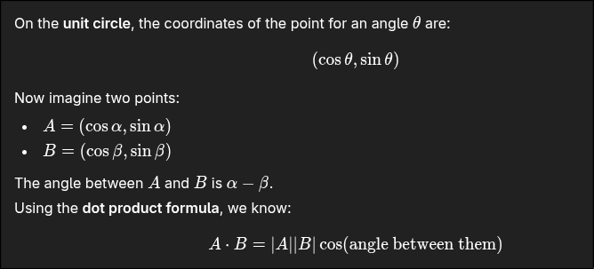

Falar sobre trigonometria e as suas funcoes inversas

- Falar sobre as propriedades adicao, arco duplo, sen e cos, e etc ...
- Mostrar como obter proof of equations: Pensar geometricamente. 

- arcsin(x) funcao inversa de sin(x) 
- arccos(x) funcao inversa de cos(x)
- Pensar como se y = cos(x) em que x = PI/2 y = 0. Ou seja para a funcao inversa  y = arccos(x) para y = 0, será a mesma coisa que inverter o y com o x, ou seja vamos ter o seguinte: x = cos(y) , x = cos(0) == 1 
- arctan(x) funcao inversa de tan(x)
- cot(x) = cos(x)/sin(x)
- arccot(x) funcao inversa de cot(x)
- sec(x) = 1/cos(x)
- cosec(x) = 1/sen(x)

Falar sobre Funcoes exponenciais e logaritmicas
- Propriedades simples
- Propriedades operatorias
- Propriedades mudanca de base
- ln(x) mesma coisa que log,e x

Falar sobre derivada
- Reta tangente a um ponto , tmb denominado de declive
- Regras de derivacao
- Regras de derivacao novas: base constante e expoente variavel
    - Ou seja h(x) = K^v(x) ---- h'(x) = K^v(x)*v'(x)*ln(K) 
- Base variavel e expoente variavel
    - Regra do exponencial + regra da potencia ou seja
    - h(x) = u(x)^v(x) ---- h'(x) = u(x)^v(x)*v'(x)*ln(u(x)) + v(x)*u(x)^(v(x) - 1)* u'(x)

- Ver exercicios da ficha 1 para fazer:

1.1 - e), f), g), h), k), n) e o)

1.2 - a), d), f)

1.3 - a), d)

1.4) - quase todos

1.7) - 1,4,5

