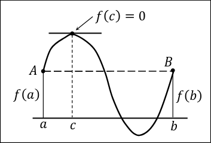

Regra da Cadeia:

Ajuda a simplificar derivacao em  exercicios com funcoes compostas:

𝑦 = (𝑥 + 𝑥^2 − 2𝑥^5 )^6

podemos simplificar assumindo que u = 𝑥 + 𝑥^2 − 2𝑥^5
- Ver pagina com o exercicio

Para funcoes trigonometricas - ver pagina exercicio

Para funcoes inversas - ver pagina exercicio

- Teorema dos Acréscimos Finitos (Lagrange)
O teorema refere que caso 𝑓 (𝑎) = 𝑓 (𝑏) num intervalo entre a e b em que a funcao é continua e derivavel, 
podemos dizer entao que existe pelo menos um ponto em que f(c) = 0.

