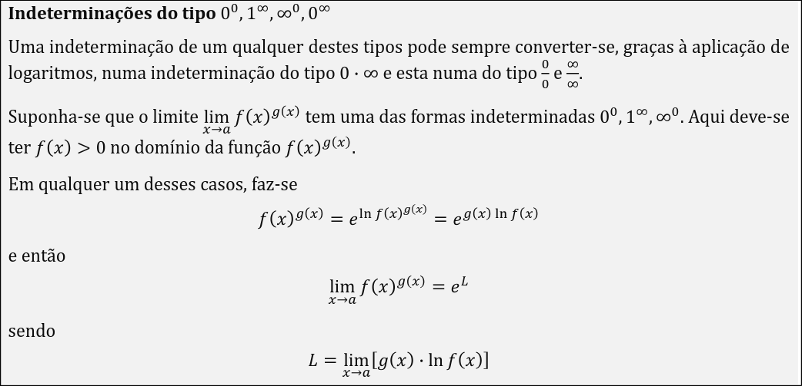

Diferenciação em R

Para que server ?

Estimar pequenas mudanças em funções sem ter que calcular valores exatos.

Atraves da variacao de x podemos calcular a estimativa do valor exato dessa mudança.
Basicamente (variacao de y) = f(x+ variacao de x) - f(x) ( Faz sentido visto que a funcao é garantida que tenha valores incrementais para ser diferencial)

Decorar formula: 

Teorema de Cauchy: 
Serve de base para utilizar a regra de lhopital. Nao necessario saber.

Regra de L'hopital pode ser aplicada em limites em que divisao entre 0's e divisao entre infinitos. Cuidado que podemos reduzir uma outra indeterminacao para este tipo.

- Ver exercicios aplicar regra de l'hopital

Ter em atencao os tipos de indeterminacao.

Polinomio de Taylor serve para fazer uma melhor aproximação de funções complexas, como por exemplo sin(x), e^x. Em vez de utilizar a aproximação linear através da tangente,fazemos a aproximacação através de derivadas de mais alto grau.

Para tal aproximação fazemos o somatório das varias derivadas até `n`, no ponto `a`.

Como chegamos à formula do polinomio de Taylor ? 

Primeiro assumimos que o polinomio é do tipo P(x) = b0 + b1*(x-a) + b2*(x-a)²

Falar sobre polinomio de Taylor e o seu resto. Parte meio rota tbh. Ao fazer este exercicio, ao ver o crescimento das derivadas em funcao de k até n, temos de transformar num padrão.

- Ver exercicio 31 para exemplo

- Polinómio de Maclaurin de 𝑓 𝑥 : ter em conta o polinomio de taylor é centrado em a, ou seja a = 0. Pode ser usado quando o valor de a não é referido.