Continuação polinomio de Taylor

Considerar agora que o valor do resto = 0, quando o valor de n tende para ∞.

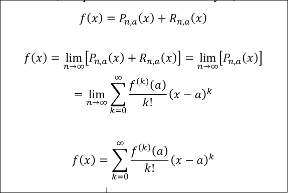

Para series de taylor, quando o valor é 0 intercaladamente podemos considerar um estado morto, ou seja, podemos ignorar esses termos. E.g cos(x), sin(x) e etc..

Ver exercicios 35 : Foi feito.

Falar sobre séries numericas.

Falar sobre as propriedades aditiva.
- A soma de dois valores dentro de um somatorio pode-se separar com a soma de ambos os sumatorios das duas incognitas.

Propriedade homogénea:
- a multiplicacao de uma constante pode ser posta de fora do somatorio.

Num somatorio pode haver 3 tipos de avalicaoes:
- É convergente. Ou seja a soma de todos os valores da um valor finito.
- É divergente. OU seja a soma de todos os valores nao tem um valor concreto.
- Ou nao se pode concluir nada. Isto acontece caso seja a soma de dois somatorios divergentes.

Propriedade telescopia. 
Caso a sucessao seja do tipo:

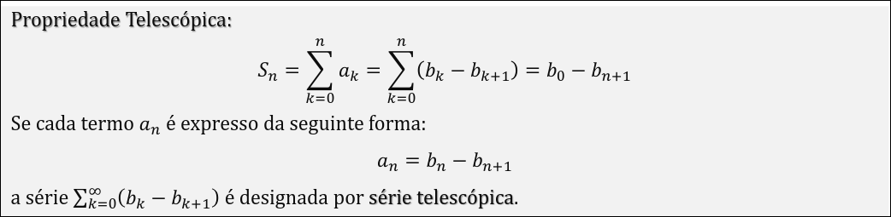

Conseguimos determinar facilemente a sua convergencia.

Podemos tambem simplificar a sucessao para :

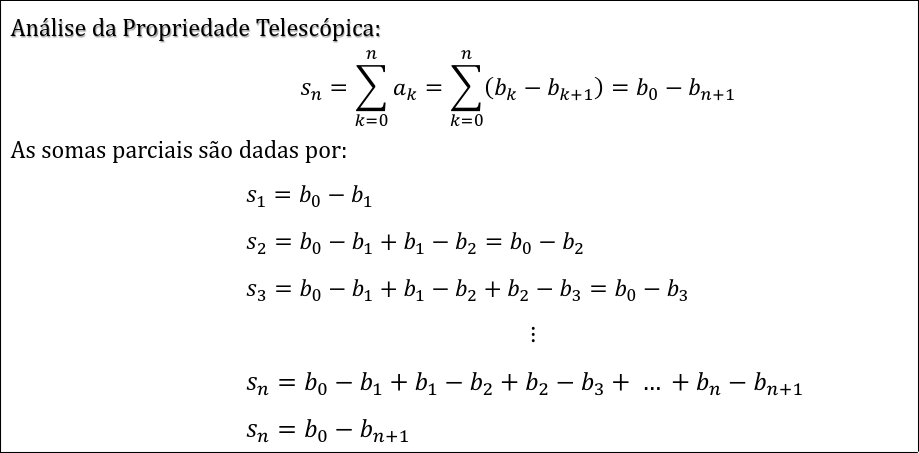

Como fatorizar/resolver este tipo de exercicios.

Primeiro verificar sempre se o denominador tem grau maior que o numerador.

Depois aqui temos a tabela de fatorizacao:

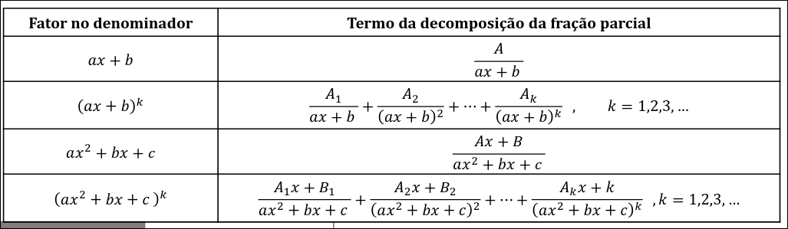

Num exercicio destes o objectivo é fatorizar ao maximo o denomiador. Ao acabar isso verificar que regra usar. 
Se for:
- (x-a) -> A/(x-a)  
- (x-a)^k -> fazer ate k a geracao desses ou seja, A/(x-a)¹, B/(x-a)² ... C/(x-a)^k
- (ax² + bx + c) -> (A*x + B)/(ax² + bx + c)
- mesma regra para (ax² + bx + c)^k

Nos casos em que grau de numerador > grau de denominador, aplicar a divisao primeiro.

Ver exercicio: 

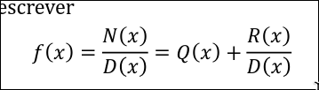

Tipos de séries:
- Séries Telescópicas
- Séries Geometricas

Ver exercicio 38.

Ver exercicio 39.

Séries geometricas sao validas apenas se |x| < 1.

Ver exercicio 40.
- Primeiro meter nesta forma e dps fazer multiplicacao dos dois lados por (x - 1)
 
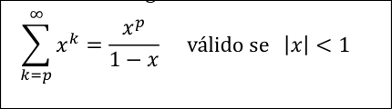

Falar sobre critérios de comparacao e como sao uteis para determinar a convergencia de uma serie. 
Falar que estes critérips apenas se aplicam para séries de termos não **negativos**, ou seja nenhum termo pode ser menor que zero. 
Apenas consideramos que este teorema funciona se tivermos para todos os termos em que bn seja maior que an.

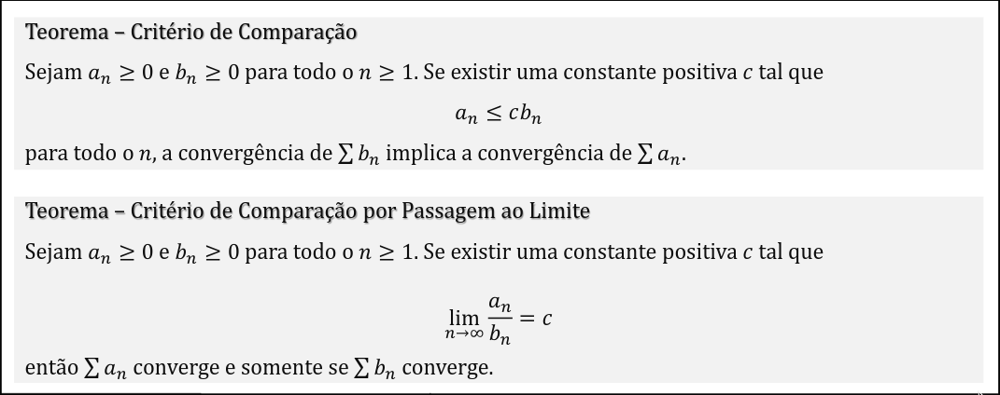

O Teorema – Critério de Comparação por Passagem ao Limite pode ser combinado com o seguinte teorema. 
O por comparacao por limite funciona apenase se e só se c tiver um valor positivo, se não for o caso não dá.
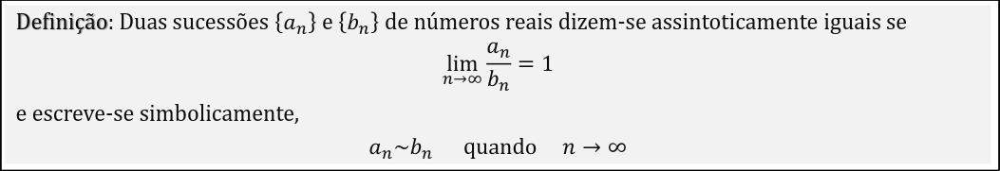

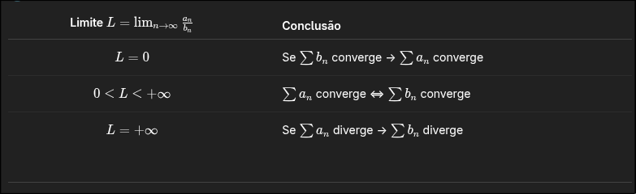

- Podemos fazer isto assumindo que na nossa atual sucessao seja (a,n) e pode mos assumir uma funcao (b,n) em que teremos de provar o seguinte.

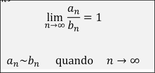

Assim encaixamos as duas e podemos determinar a convergencia ou divergencia de ambas.

Podemos sempre usar as funcoes deste tipo, sendo que sao todas convergentes caso n^p onde p > 1.

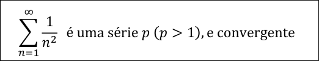

Falar sobre Teorema da raiz

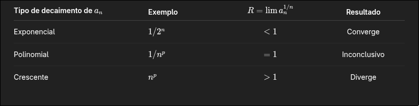

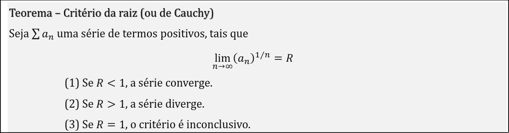

Falar sbore teorema do quociente:

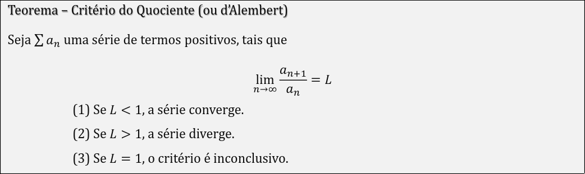

Falar sbore o criterio de leibniz

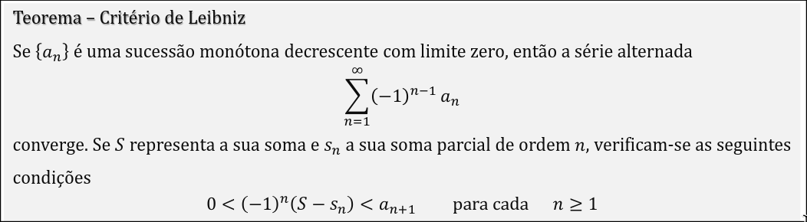

