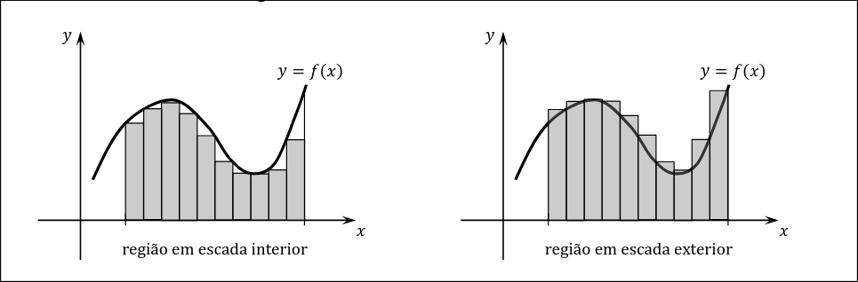
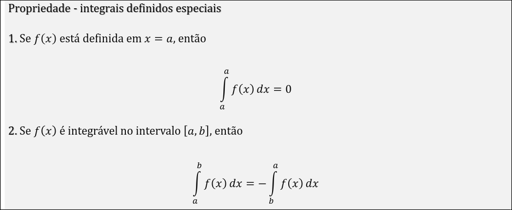
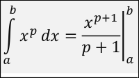
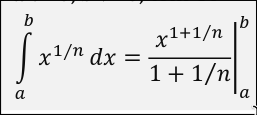
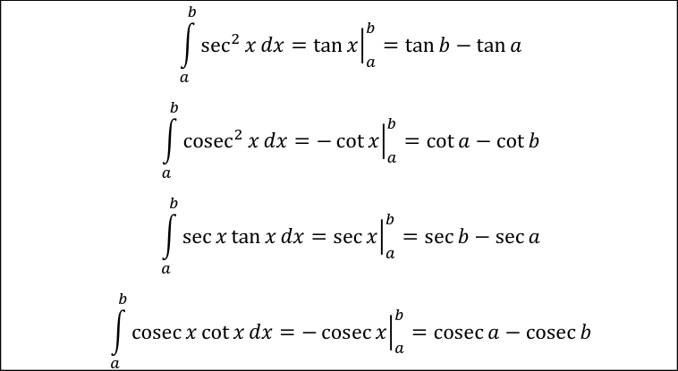
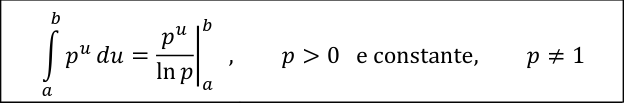

Continuacao de séries numericas 💀 - Apenas exercicios e resumindo como utilizar

Falar sobre Integrais definidos. 

Integral = Área por de baixo dessa funcão num determinado intervalo.

Teorema de Riemman: Duas maneiras de calcular uma integral.

Através da regiao em escada interior, ou esquada exterior. 
Escada exterior vai ter erro positivo, ou seja, uma estimativa do valor mais acima. Enquanto que a escada interior, vai ser uma aproximação de um valor inferior à área.

Como fazer este calculo ?
Simples ver os pontos intermedios e ir calculando a area dos pequenos retangulos ate chegar ao fim.

- E.g  Somatório(x -> a , até b) ∆𝑥 * f(M1), com M1 o extremo direito. Neste caso será o exterior.

Dps eles falam sobre integrais superiores e inferiores, precisamente o que falamos anteriormente mas com menos detalhe.

Falar sobre Propriedades de integrais definidos.

- Propriedade - Linearidade relativamente à função integrada, pode se separar integrais de somas.
- Propriedade - Aditividade com respeito ao intervalo de integração, Caso estejamos a fazer a soma de dois integrais da mesma funcao, e que os intervalos vao de a->c , c -> b, podemos juntar tudo num para o intervalo a->b
- Propriedade - Invariância sob translação
- Propriedade - Dilatação ou contração do intervalo de integração
 

Ver Teoremas das Regras das integrais.

- No caso, a integral de uma funcao constante é k*(b-a) onde o integral vai de a->b. 
- Integral de uma potencia de x^p
 

- Ver as trigonometricas.
- 
Estas precisamos de decorar:

Integral de e^x é e^x.

Regra exponencial base é:

Intregal de 1/x vai ser a mesma coisa que |ln(x)|