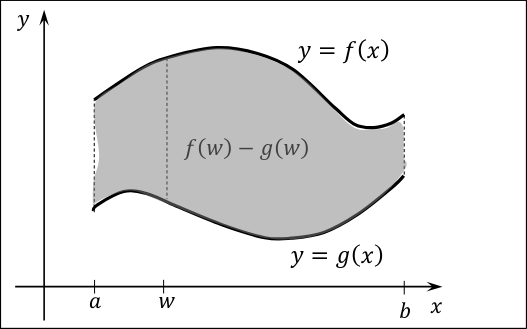
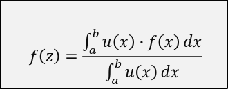

B.2. Cálculo de Áreas e Teoremas do Valor Médio para Integrais 🙏

- Fazer o calculo de Áreas através de integrais. Caso f(x) >= g(x) onde elas podem se tocar mas nunca se cruzam, podemos calcular a área entre as duas, através da diferença de integrais entre (f(x) - g(x)).

- Ver exercicios e explicar como fazer, sao simples apenas perceber como obter as funcoes corretas e aplicar os intervalos corretos.

Falar sobre o Teorema do Valor Médio para Integrais:

- Falar sobre valor médio e o que significa. Neste caso é o valor médio da altura da função. É dito que existe pelo menos um ponto na função que é igual ao valor médio da altura.

- Podemos extender este teorema e aplicar `pesos`, ou seja, importancia a cada ponto determinando assim a sua altura média de forma diferente.

No caso a formula tomaria o seguinte formato.

